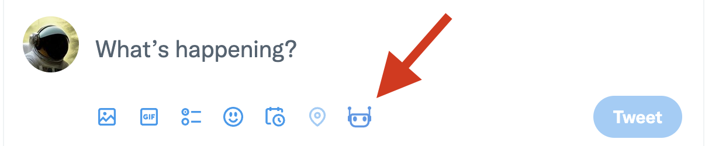
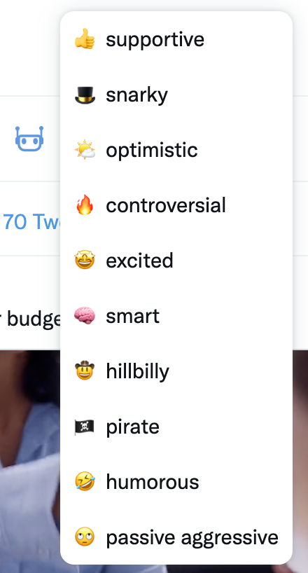
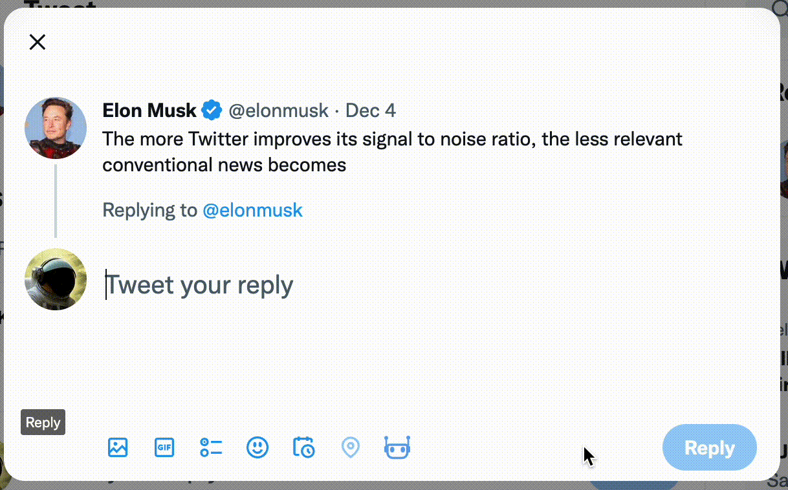

## Notice
This is a fork of https://github.com/yaroslav-n/tweetGPT since that project is not supported anymore. 

This project also improves on the cost by using Google Gemini instead of ChatGPT. Gemini has a generous free quota of 60 calls per minute thus making it practically free for this project's purpose. 

Big thanks to the yaroslav-n@ for providing a platform to build upon. 

## Requirements
To use this extension, will you need:
* Twitter account
* Gemini API key. Get it from [here](https://makersuite.google.com/).
* Chrome browser

## Installation
1. Clone this repo to your machine / download the source code.
2. Open [chrome://extensions/](chrome://extensions/) in your browser
3. Check the box for Developer mode in the top right
4. Press __Load Unpacked__ button and select the folder with the code
5. The settings screen should open, where you need to put your Gemini API Key.

You can start using the extension now.

## How to use Tweet Gemini
When you open a new tab with Twitter, you will see this icon under the tweet section:

When you press it, it will let you select a type of tweet to generate. The types include positive, negative, controversial, etc. 

Once selected, the extension will write a new tweet.

For a reply, it will generate a tweet based on the original tweet. For a new tweet, it will ask for a topic you want to write tweet about.

